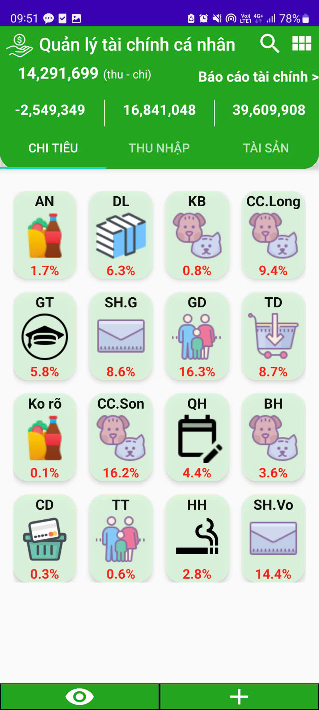
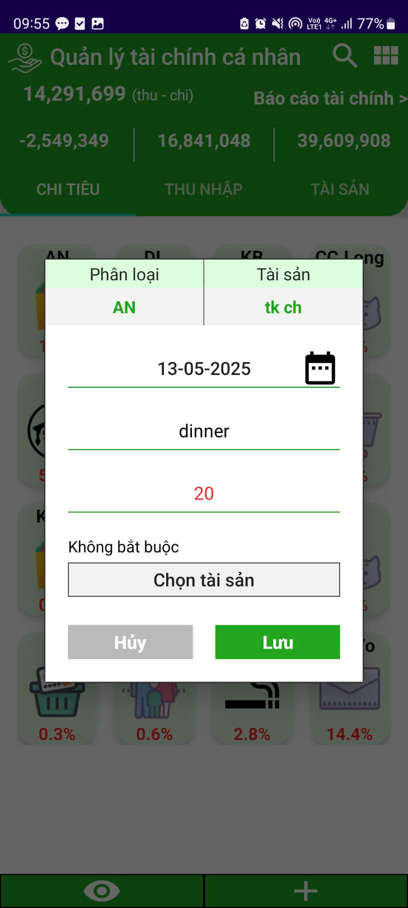
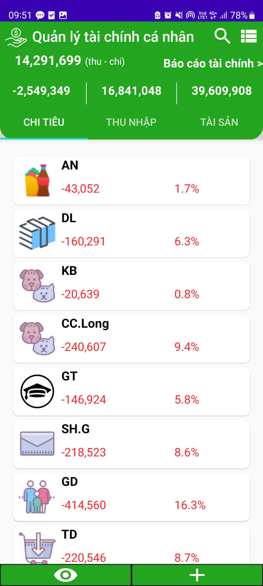
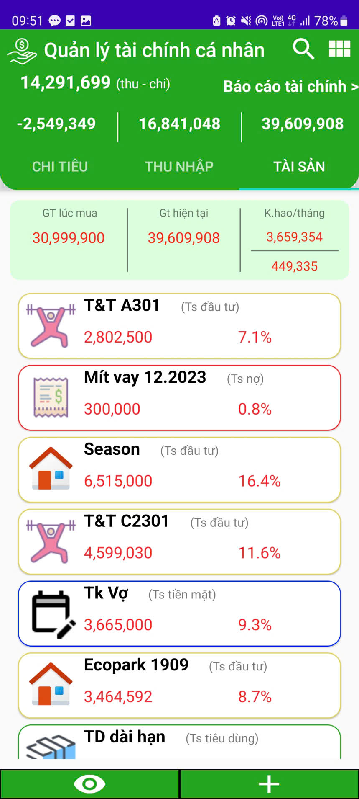
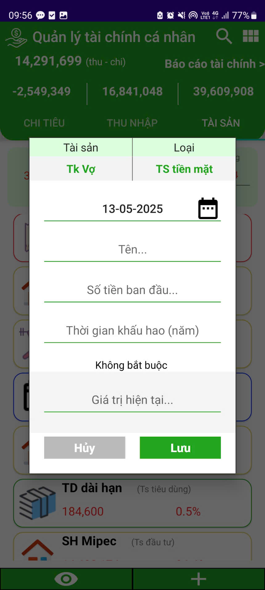
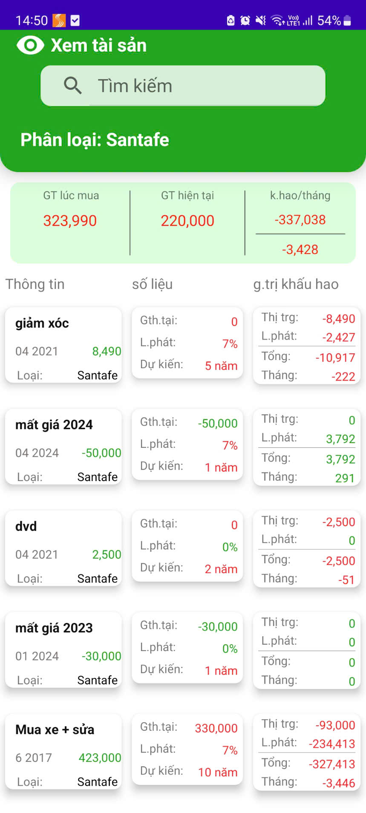
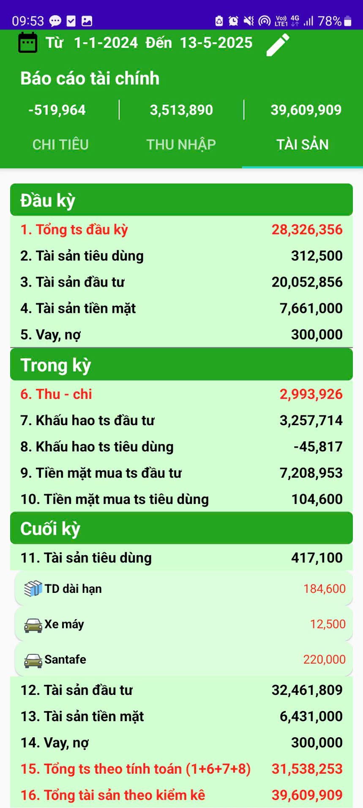
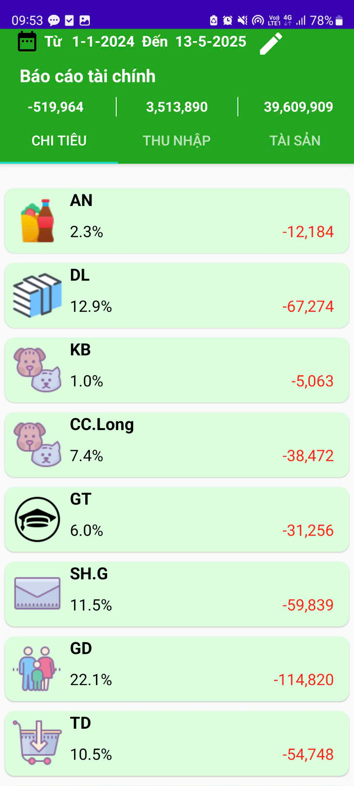
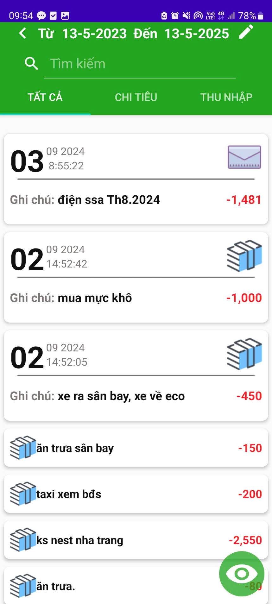

# QuanLyTaiChinhCaNhan (PersonalFinancialManagement)

This is an Android app I made in 2021. The English version will be updated soon.

## Table of content

- [Installation](#Installation)
- [Overview](#Overview)

## Installation

### Android (apk)

[https://drive.google.com/file/d/1Kv88iye-5Cc3ebfMQfjScrVSk9sgt2WI/view?usp=sharing](https://drive.google.com/file/d/1Kv88iye-5Cc3ebfMQfjScrVSk9sgt2WI/view?usp=sharing)

### For editing

```bash
git clone https://github.com/hailong103207/PersonalFinancialManagement.git
```

I recommend use [Android Studio](https://developer.android.com/studio?hl=vi). Pixel 2 API 28 for virtual device.

## Overview

### Income and Expense Tracking

Record income and expenses for each category with just one tap.

  

### Asset Management

Manage various types of assets with financial functions such as inflation, interest rates, and depreciation, allowing users to track losses from liabilities and interest earned from investments.

  

### Statistics and Financial Reports

View income and expense history, and track asset fluctuations over your desired time period.

  
